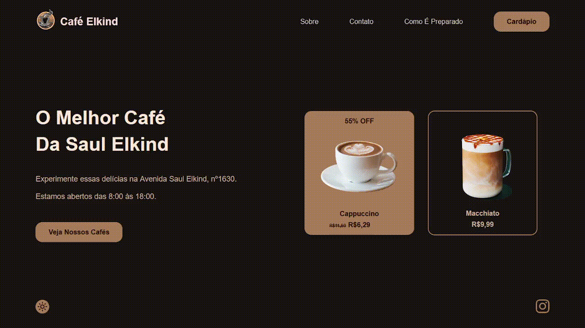

<h1 align="center">Café Elkind</h1>

## Sobre

Uma [_landing page_](https://sebrae.com.br/sites/PortalSebrae/artigos/o-que-e-uma-landing-page,3e1e097399323810VgnVCM100000d701210aRCRD) para uma cafeteria fictícia que está começando seu negócio na avenida Saul Elkind.

A página possui uma frase impactante em negrito e um convite para o cliente a visitar a loja, incluindo um endereço e horário de atendimento, além de um botão que levaria a uma página com todos os cafés à venda na cafeteria. Ao lado, dois exemplos: um macchiato em uma área com borda colorida e arredondada, e um cappuccino, que, por estar com 55% de desconto, possui um design mais chamativo que o macchiato.

Abaixo estão botões de troca de temas e uma logo do Instagram, que, ao ser clicada, leva à página da instituição na plataforma.

## Paleta de cores

A paleta de cores foi selecionada com base em três cores principais: Café Noir (#4B3621), Coffee (#6F4E37) e Café au Lait (#A67B5B). As duas primeiras foram utilizadas como base para o tema escuro, enquanto a útlima foi a base do tema claro.

| Tema escuro | Tema claro |
| :---------: | :--------: |
|   #4B3621   |  #A67B5B   |
|   #6F4E37   |  #D49E74   |
|   #FFE9D9   |  #191414   |
|   #2E0D00   |  #FFE9D9   |
|   #83442C   |  #FFDED9   |
|   #94543B   |  #CCAE99   |
|   #612913   |  #DBC8BA   |

## Imagens

* [Logo - RawPixel](https://www.rawpixel.com/image/6552393/png-sticker-logo);
* [Cappuccino - Pikbest](https://pikbest.com/png-images/steamy-delights-hot-cappuccino-coffee-inspirations_9229935.html);
* [Macchiato - Starbucks](https://www.starbucks.com/menu/product/2123563/hot).

## Tecnologias utilizadas

* ✅ HTML5;
* ✅ CSS3;
* ✅ JavaScript.

## Referências

* [Tutorial - Landing Page (HTML, CSS e JS)](https://www.youtube.com/watch?v=RaITAxEdTDY);
* [Coffee (color)](https://en.wikipedia.org/wiki/Coffee_(color));

## Autor

* [Nathan2076](https://github.com/Nathan2076), com a ajuda de [Leonardo Rocha](https://github.com/leonardossrocha).
